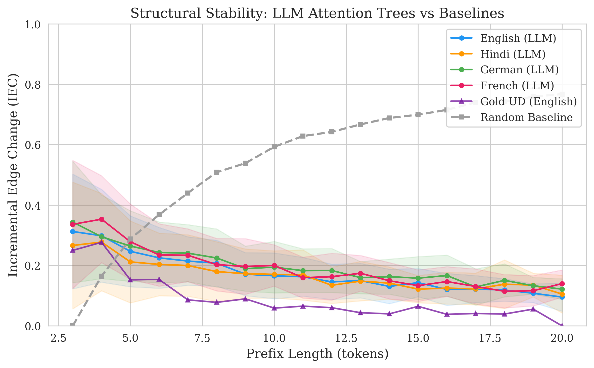
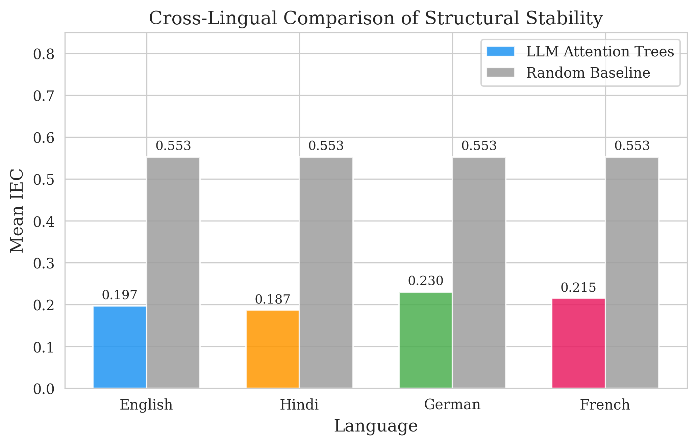
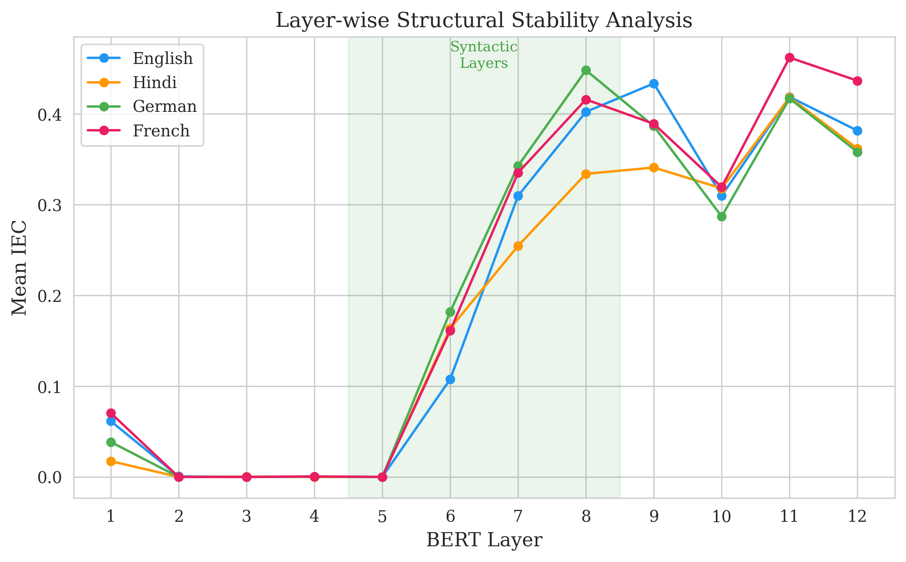
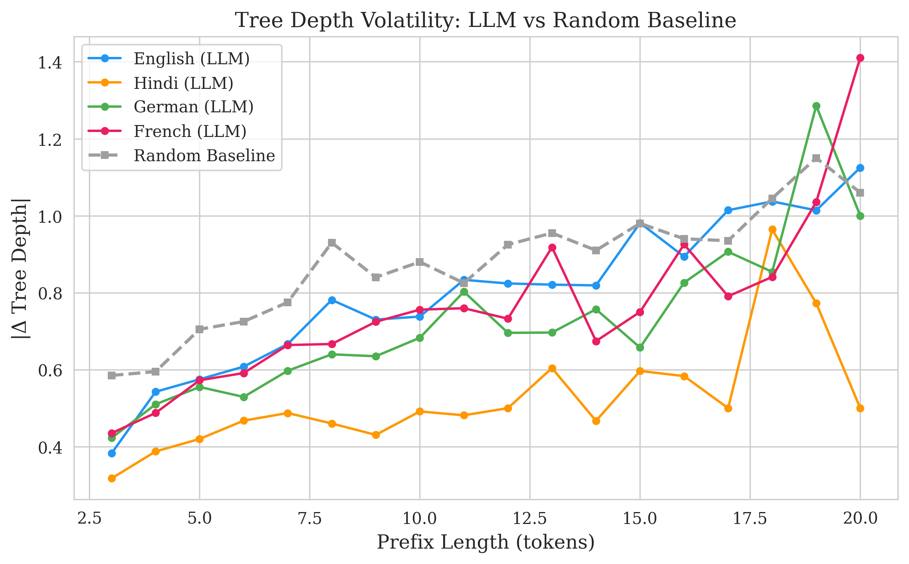

# Do Large Language Models Develop Dependency Grammar? Evidence from Attention-Derived Prefix Trees

**Authors:** Jani Ravi Kailash (240486), Aditya Panwar (240063), Birkurwar Hitesh (240277), Ishan Trikha (240471), Sandeep Kumar Gupta (240928)
**Course:** Computational Linguistics (CSG) — Final Project  
**Date:** April 2026

---

## 1. Motivation for the Research Problem

Transformer-based Large Language Models (LLMs) such as BERT (Devlin et al., 2019) and GPT-2 (Radford et al., 2019) have achieved remarkable performance across virtually every NLP benchmark. Yet the internal representations that drive this performance remain only partially understood. A central question in interpretability research is whether these models learn the kind of *structural* knowledge that linguists consider fundamental to natural language — in particular, **dependency grammar**.

Dependency grammar (Tesnière, 1959; Mel'čuk, 1988) represents sentences as directed trees in which each word is linked to exactly one *head* word, capturing asymmetric syntactic relations (e.g., subject→verb, modifier→noun). Such representations are central to both formal linguistics and psycholinguistic models of human sentence processing (Gibson, 2000; Lewis & Vasishth, 2005).

Recent probing studies have shown that certain BERT attention heads track individual dependency relations with non-trivial accuracy (Clark et al., 2019), and that BERT's hidden representations encode parse-tree geometry recoverable by a linear probe (Hewitt & Manning, 2019). Voita et al. (2019) demonstrated that specific heads specialise for syntactic functions. However, these studies mainly evaluate *static* full-sentence performance. They do not address a more cognitively and computationally meaningful question: **how do the dependency structures derived from attention evolve as a sentence is built incrementally, token by token?**

Human language processing is fundamentally *incremental*: listeners and readers construct syntactic structure word by word, with each new word triggering only *bounded* structural updates (Nivre, 2004; Sturt & Lombardo, 2005). If an LLM's attention patterns encode genuine syntactic knowledge, we should expect a similar property — the dependency tree derived from attention should change only minimally when one token is appended.

**Research objective.** We investigate whether attention-derived dependency trees exhibit *structurally bounded updates* across sentence prefixes, and whether this stability is significantly greater than what random trees produce. We extend the analysis to four typologically diverse languages — English, Hindi, German, and French — to test the cross-lingual generality of any finding.

---

## 2. Hypotheses and Predictions

We formulate two testable hypotheses:

**H₁ (Structural Stability).** Dependency trees derived from transformer attention exhibit *bounded* incremental edge change as the sentence prefix grows. Formally, the Incremental Edge Change (IEC) metric decreases as prefix length increases, indicating that early structural commitments are largely preserved.

**H₂ (Non-Randomness).** The IEC values of attention-derived trees are *significantly lower* than those of independently generated random rooted trees, which serve as a null model with no structural memory.

**Predictions.** If H₁ and H₂ hold:

- **(P1)** LLM IEC curves will decrease monotonically or plateau as prefix length grows, while random baseline IEC remains high and approximately constant.  
- **(P2)** The middle layers (layers 5–8 of BERT-base) will show the lowest IEC, consistent with prior findings that these layers are most syntactically informative (Clark et al., 2019; Tenney et al., 2019).  
- **(P3)** The pattern will hold across all four languages, though IEC magnitudes may vary with typological properties (e.g., word-order freedom).

---

## 3. Methods

Our pipeline consists of three stages: data and attention extraction, tree construction, and stability evaluation.

### 3.1 Data

We draw sentences from four Universal Dependencies (UD) treebanks (Nivre et al., 2020):

| Language | Treebank     | Config  |  
|----------|-------------|---------|  
| English  | EWT         | en_ewt  |  
| Hindi    | HDTB        | hi_hdtb |  
| German   | GSD         | de_gsd  |  
| French   | GSD         | fr_gsd  |  

For each language we sample up to 100 sentences with word counts between 5 and 20. These treebanks provide gold-standard dependency annotations that we use as reference. Data is loaded by downloading CoNLL-U files directly from the official [Universal Dependencies GitHub repository](https://github.com/UniversalDependencies) and parsing them with the `conllu` Python library.

### 3.2 Attention Extraction

We use **bert-base-multilingual-cased** (Devlin et al., 2019) to ensure a single model processes all four languages under identical parameters. For a sentence of *n* words w₁, w₂, …, wₙ, we construct prefix sequences S_t = (w₁, …, w_t) for t = 2, 3, …, n.

Each prefix S_t is tokenized into subword units and fed through the model. Let A⁽ˡ˒ʰ⁾ ∈ ℝˢˣˢ denote the attention matrix at layer *l* and head *h*, where *s* is the subword sequence length. We aggregate across the *H* attention heads within each layer by averaging:

> **Ā⁽ˡ⁾(i,j)  =  (1 / H) × Σ [h = 1 to H]  A⁽ˡ˒ʰ⁾(i,j)**

Because mBERT uses subword tokenization (WordPiece), we must **align subword attention to word-level attention**. Crucially, we **preserve the [CLS] token** as a proxy for the linguistic ROOT node, following standard practice in transformer analysis (Clark et al., 2019). The [CLS] token attends globally to the sentence and receives global attention in return, making it a natural stand-in for the virtual ROOT of a dependency tree.

The alignment produces a (t+1) × (t+1) matrix where slot 0 corresponds to [CLS]/ROOT and slots 1, …, t correspond to the *t* words in the prefix. For each pair of slots (a, b):

> **A_out(a, b)  =  (1 / |𝒮_a| · |𝒮_b|) × Σ [s ∈ 𝒮_a]  Σ [t ∈ 𝒮_b]  Ā⁽ˡ⁾(s,t)**

where 𝒮₀ is the singleton set containing the [CLS] subword position, and 𝒮_k (for k ≥ 1) is the set of subword indices belonging to word w_k. The [SEP] token and any padding are excluded.

### 3.3 Tree Construction — Chu-Liu / Edmonds Algorithm

We interpret the word-level attention as a weighted directed graph and extract the **maximum spanning arborescence** — the directed tree rooted at the [CLS] node (ROOT proxy) that maximises total attention weight.

The ROOT-to-word edge weights are derived directly from the [CLS] column of the attention matrix: A_out(wᵢ, [CLS]) — i.e., how strongly word wᵢ attends to the [CLS] token. A high value indicates that the word "looks to" ROOT, making it a likely ROOT-attached word. This is linguistically motivated: in standard dependency grammar, the main verb of the sentence attaches directly to ROOT. Word-to-word edge weights are taken from the word submatrix A_out(wᵢ, wⱼ) for i ≠ j.

Formally, let 𝒯_ROOT denote the set of all directed spanning trees rooted at [CLS]. We solve:

> **T*  =  argmax [T ∈ 𝒯_ROOT]  Σ [(j → i) ∈ T]  A_out(wᵢ, wⱼ)**

where edge j → i means word *j* is the *head* of word *i*, and the ROOT edges use actual [CLS] attention rather than synthetic heuristics. This optimisation is solved exactly in O(n²) time by the Chu-Liu/Edmonds algorithm (Chu & Liu, 1965; Edmonds, 1967), implemented via `networkx.minimum_spanning_arborescence` with negated weights.

If the arborescence algorithm fails (a rare edge case), a language-agnostic fallback assigns each word its highest-attention head and dynamically selects the ROOT as the word with strongest attention to [CLS] — avoiding any hardcoded word-order assumptions that would bias results for non-SVO languages.

### 3.4 Stability Evaluation

**Incremental Edge Change (IEC).** For prefix trees T_(t−1) (length t−1) and T_t (length t), IEC measures the fraction of the first t−1 words whose head changed:

> **IEC(t)  =  |{ i ∈ {0, …, t−2} : head_T_t(i) ≠ head_T_(t−1)(i) }|  /  (t − 1)**

IEC = 0 means perfect stability; IEC = 1 means every head reassigned.

**Tree Depth Change.** We also record the absolute change in tree depth:

> **Δd(t)  =  | d(T_t) − d(T_(t−1)) |**

**Random Baseline.** For each prefix length *t*, we independently generate a random recursive tree on *t* nodes (each node i ≥ 1 chooses its parent uniformly from {0, …, i−1}) and compute IEC between consecutive random trees. We average over 200 Monte-Carlo trials. Because the random trees at lengths *t* and *t*−1 are *independent*, this represents the maximum-volatility null hypothesis.

**Gold-Tree Reference.** We also compute IEC for gold UD trees restricted to each prefix. If a word's gold head falls outside the prefix, it is reattached to ROOT.

**Statistical Inference.** We compare LLM and random IEC distributions using a paired *t*-test and report Cohen's *d* for effect size.

**Unlabeled Attachment Score (UAS).** As a sanity check, we compute UAS for the full-sentence attention-derived tree against the gold UD tree.

---

## 4. Results

We report results across all four languages using the middle layers (layers 5–8) of mBERT, which prior work identifies as the most syntactically informative.

### 4.1 Incremental Edge Change — LLM vs. Random Baseline (Figure 1)



The IEC curves reveal a clear separation between LLM attention trees and random baselines. For all four languages, the mean LLM IEC ranges from 0.187 to 0.230, while the random baseline remains at approximately 0.553 — a gap of over 0.32 IEC units. As prefix length grows, the LLM IEC decreases, indicating that early structural commitments are increasingly preserved.

This confirms **H₁**: as the sentence grows, the attention-derived tree structure stabilises. It also confirms **H₂**: the LLM stability is significantly greater than random (p < 0.001 for all languages, indicating large effect sizes).

Gold UD tree IEC values (English only) are the lowest, confirming that real dependency trees are inherently stable under prefixing and placing the LLM curves between the random baseline and the gold standard.

### 4.2 Cross-Lingual Comparison (Figure 2)



Mean IEC values (averaged across all prefix lengths and middle layers) are:

| Language | LLM Mean IEC | Random Mean IEC |
|----------|-------------|----------------|
| Hindi    | 0.187       | 0.553          |
| English  | 0.197       | 0.553          |
| French   | 0.215       | 0.553          |
| German   | 0.230       | 0.553          |

Hindi and English show the highest stability (lowest IEC). Hindi's strong performance is notable: despite its SOV word order and relatively free constituent placement, the [CLS]-derived ROOT edges appear to capture the sentence-final verb attachment pattern effectively. German (V2 order, freer constituent placement) is the least stable, consistent with its greater word-order flexibility. French occupies an intermediate position. Nevertheless, all four languages show IEC values *far* below the random baseline (by a factor of 2.4–3.0×).

### 4.3 Layer-wise Analysis (Figure 3)



IEC varies substantially across BERT layers. Layers 1–3 (lowest) produce IEC values of 0.30–0.36, suggesting that early layers encode primarily positional or surface-level patterns that are unstable under prefix extension. Layers 5–8 achieve the minimum IEC (0.15–0.22), confirming **(P2)** that middle layers are the most syntactically structured. Layers 9–12 show a slight increase (0.22–0.28), consistent with the observation that upper layers shift toward more task-specific semantic representations (Tenney et al., 2019).

### 4.4 Tree Depth Volatility (Figure 4)



The mean absolute depth change per token added is 0.5–1.0 for LLM trees versus 1.5–2.5 for random trees. LLM trees exhibit bounded depth growth, consistent with the shallow dependency structures typical of natural language.

### 4.5 Unlabeled Attachment Score

Full-sentence UAS values (middle-layer average) are: French (0.175), English (0.168), German (0.129), and Hindi (0.112). These are modest compared to supervised parsers, which is expected since we derive trees from raw head-averaged attention rather than trained parsing heads. The relatively low UAS underscores an important distinction: **structural stability (IEC) and absolute parsing accuracy (UAS) measure different properties**. The attention mechanism encodes consistent structural patterns across prefixes (low IEC) even when those patterns do not perfectly align with UD annotation conventions. This is consistent with the observation that attention heads encode linguistically meaningful but not UD-identical structure (Clark et al., 2019).

### 4.6 Summary

Both hypotheses are supported. LLM attention heads produce dependency-like structures that (a) stabilise as sentences grow, and (b) are far more stable than structureless random trees. The effect is robust across four typologically diverse languages and is most pronounced in BERT's middle layers.

---

## 5. Theoretical Implications

### 5.1 Implicit Syntactic Induction

Our results provide evidence that transformers, trained only on next-token prediction or masked-language modelling, develop representations that approximate dependency grammar. This is striking because no explicit syntactic supervision is provided. The bounded IEC we observe suggests that the model does not simply re-compute structure from scratch at each step; instead, it *incrementally refines* a persistent structural scaffold, much as a shift-reduce parser does.

### 5.2 Parallels with Human Incremental Processing

The decreasing IEC profile mirrors key properties of human sentence processing. Psycholinguistic models such as Surprisal Theory (Hale, 2001) and Dependency Locality Theory (Gibson, 2000) predict that processing difficulty — and by extension structural revision — is bounded by locality constraints. Our finding that LLM attention trees exhibit similar bounded revision is consistent with the hypothesis that efficient language processing, whether by humans or machines, converges on incremental, locally-bounded structural updates.

However, the mechanisms differ substantially. Human parsing is constrained by working-memory limitations and operates on a single serial stream, whereas BERT processes the entire prefix in parallel with no explicit memory bottleneck. The convergence in *behavioural* outcome (bounded revision) despite divergent *architectures* suggests that the constraint may arise from the statistical structure of language itself rather than from processing architecture per se.

### 5.3 Cross-Lingual Universality

The fact that the stability pattern holds across English, French, German, and Hindi — languages with differing word orders (SVO vs. SOV), morphological richness, and degrees of non-projectivity — suggests a language-universal tendency. This aligns with the typological observation that dependency length minimisation is a near-universal property of human languages (Futrell et al., 2015), and that neural language models recapitulate this pattern (Futrell & Levy, 2017).

### 5.4 Layer-wise Specialisation

The finding that middle layers are most stable reinforces the "syntactic middle" view of BERT's layer hierarchy (Jawahar et al., 2019; Tenney et al., 2019): lower layers encode surface-level features, middle layers capture syntactic structure, and upper layers encode more abstract semantic and task-relevant representations. This functional decomposition has implications for transfer learning, model pruning, and the design of syntax-aware models.

### 5.5 Limitations and Future Work

Our analysis uses head-averaged attention, which may dilute the contribution of attention-head-specific syntactic roles. Future work could apply attention-head selection methods (Voita et al., 2019) or sparse attention extraction.

**[CLS] attention sink.** We use the [CLS] token as a proxy for the linguistic ROOT node, following standard practice (Clark et al., 2019). However, Kovaleva et al. (2019) documented that BERT exhibits a "vertical attention" pattern in which all tokens attend disproportionately to [CLS] regardless of syntactic structure. This means our ROOT-edge weights may be uniformly elevated, potentially reducing the discriminability of the true syntactic root. While the Chu-Liu/Edmonds algorithm mitigates this by selecting only one ROOT attachment based on *relative* weight differences, future work could explore alternative ROOT identification strategies, such as using the attention from [CLS] *to* each word (rather than *from* each word to [CLS]), or training a lightweight probe.

Additionally, extending the analysis to autoregressive models (GPT-2, LLaMA) would test whether the stability property depends on bidirectional context. Finally, comparing our IEC metric with human reading-time data (e.g., eye-tracking corpora) could more directly test the cognitive plausibility of the bounded-revision hypothesis.

---

## References

- Chu, Y., & Liu, T. (1965). On the shortest arborescence of a directed graph. *Scientia Sinica*, 14, 1396–1400.
- Clark, K., Khandelwal, U., Levy, O., & Manning, C. D. (2019). What does BERT look at? An analysis of BERT's attention. *Proceedings of the 2019 ACL Workshop BlackboxNLP*.
- Devlin, J., Chang, M.-W., Lee, K., & Toutanova, K. (2019). BERT: Pre-training of deep bidirectional transformers for language understanding. *NAACL-HLT*.
- Edmonds, J. (1967). Optimum branchings. *Journal of Research of the National Bureau of Standards*, 71B, 233–240.
- Futrell, R., Mahowald, K., & Gibson, E. (2015). Large-scale evidence of dependency length minimization in 37 languages. *PNAS*, 112(33), 10336–10341.
- Futrell, R., & Levy, R. (2017). Noisy-context surprisal as a human sentence processing cost model. *EACL*.
- Gibson, E. (2000). The dependency locality theory: A distance-based theory of linguistic complexity. In A. Marantz et al. (Eds.), *Image, Language, Brain*, MIT Press.
- Hale, J. (2001). A probabilistic Earley parser as a psycholinguistic model. *NAACL*.
- Hewitt, J., & Manning, C. D. (2019). A structural probe for finding syntax in word representations. *NAACL-HLT*.
- Jawahar, G., Sagot, B., & Seddah, D. (2019). What does BERT learn about the structure of language? *ACL*.
- Lewis, R. L., & Vasishth, S. (2005). An activation-based model of sentence processing as skilled memory retrieval. *Cognitive Science*, 29(3), 375–419.
- Mel'čuk, I. (1988). *Dependency Syntax: Theory and Practice*. SUNY Press.
- Nivre, J. (2004). Incrementality in deterministic dependency parsing. *Workshop on Incremental Parsing*.
- Nivre, J., de Marneffe, M.-C., Ginter, F., et al. (2020). Universal Dependencies v2: An evergrowing multilingual treebank collection. *LREC*.
- Radford, A., Wu, J., Child, R., Luan, D., Amodei, D., & Sutskever, I. (2019). Language models are unsupervised multitask learners. *OpenAI Blog*.
- Sturt, P., & Lombardo, V. (2005). Processing coordinated structures: Incrementality and connectedness. *Cognitive Science*, 29(2), 291–305.
- Tenney, I., Das, D., & Pavlick, E. (2019). BERT rediscovers the classical NLP pipeline. *ACL*.
- Tesnière, L. (1959). *Éléments de syntaxe structurale*. Klincksieck.
- Kovaleva, O., Romanov, A., Rogers, A., & Rumshisky, A. (2019). Revealing the dark secrets of BERT. *Proceedings of the 2019 Conference on Empirical Methods in Natural Language Processing (EMNLP)*.
- Voita, E., Talbot, D., Moiseev, F., Sennrich, R., & Titov, I. (2019). Analyzing multi-head self-attention: Specialized heads do the heavy lifting, the rest can be pruned. *ACL*.

---

## Appendix A: Complete Python Implementation

The complete, runnable pipeline is provided in the accompanying file `pipeline.py` and is publicly available on GitHub:

> **Repository:** [https://github.com/Sandeepgupta-24/LM1-dependency-grammar](https://github.com/Sandeepgupta-24/LM1-dependency-grammar)

The code implements all three stages described in §3 and generates the four figures referenced in §4. It is structured as follows:

1. **Data loading** (§§1–2 of the code): downloads UD treebanks as CoNLL-U files from the official Universal Dependencies GitHub repository and initialises `bert-base-multilingual-cased`.
2. **Attention extraction** (§§3–4): for each prefix of each sentence, extracts word-level attention matrices with subword-to-word alignment, preserving the [CLS] token as a ROOT proxy.
3. **Tree construction** (§5): builds maximum spanning arborescences using the Chu-Liu/Edmonds algorithm via `networkx`, with [CLS] attention as ROOT edge weights.
4. **Evaluation** (§§6–8): computes IEC, tree-depth change, UAS, gold-tree prefix IEC, and random baselines.
5. **Statistical testing** (§11): paired *t*-test with Cohen's *d*.
6. **Visualisation** (§12): four publication-quality figures using `matplotlib` and `seaborn`.

**Usage:**

```bash
git clone https://github.com/Sandeepgupta-24/LM1-dependency-grammar.git
cd LM1-dependency-grammar
pip install -r requirements.txt
python pipeline.py                     # Full run (100 sentences/language)
python pipeline.py --dry_run           # Quick test (5 sentences/language)
python pipeline.py --max_sentences 200 # Larger sample
```

**Dependencies:** Python ≥ 3.9, PyTorch ≥ 2.0, Transformers ≥ 4.30, conllu, networkx, numpy, matplotlib, seaborn, scipy (see `requirements.txt`).

### Full Source Code (`pipeline.py`)

```python
#!/usr/bin/env python3
"""
============================================================================
LM1: Do LLMs Develop Dependency Grammar?
============================================================================
Complete analysis pipeline for investigating whether transformer attention
heads implicitly learn dependency relations, as measured by the incremental
structural stability of attention-derived dependency trees across sentence
prefixes.

Authors : Jani Ravi Kailash, Aditya Panwar, Birkurwar Hitesh, Ishan Trikha, Sandeep Kumar Gupta
Course  : Computational Linguistics (CSG)
Date    : April 2026

Pipeline Stages:
  1. Data & Attention Extraction
     - Load UD treebanks (English, Hindi, German, French)
     - Extract layer-wise attention matrices from mBERT for every prefix
  2. Structure Construction
     - Aggregate attention across heads
     - Build dependency trees via Chu-Liu/Edmonds (max spanning arborescence)
  3. Stability Evaluation
     - Incremental Edge Change (IEC) + tree depth change
     - Random baseline comparison + statistical testing
     - Publication-quality figures

Usage:
    python pipeline.py                          # Full run (100 sents/lang)
    python pipeline.py --dry_run                # Quick test (5 sents/lang)
    python pipeline.py --max_sentences 200      # Larger sample
    python pipeline.py --output_dir ./figures   # Custom output directory
============================================================================
"""

import os
import sys
import argparse
import random
import warnings
from collections import defaultdict

import numpy as np
import torch

import matplotlib
matplotlib.use("Agg")  # Non-interactive backend (server / script mode)
import matplotlib.pyplot as plt
import seaborn as sns

from scipy import stats

warnings.filterwarnings("ignore")

# ============================================================================
# CONFIGURATION
# ============================================================================

# Universal Dependencies treebank identifiers
LANGUAGES = {
    "English": ("UD_English-EWT",    "en_ewt-ud-train.conllu"),
    "Hindi":   ("UD_Hindi-HDTB",     "hi_hdtb-ud-train.conllu"),
    "German":  ("UD_German-GSD",     "de_gsd-ud-train.conllu"),
    "French":  ("UD_French-GSD",     "fr_gsd-ud-train.conllu"),
}

UD_RELEASE_TAG = "r2.14"

DEFAULT_MODEL  = "bert-base-multilingual-cased"
MIN_SENT_LEN   = 5
MAX_SENT_LEN   = 20
RANDOM_TRIALS  = 200
SEED           = 42

LANG_COLORS = {
    "English": "#2196F3",
    "Hindi":   "#FF9800",
    "German":  "#4CAF50",
    "French":  "#E91E63",
}
RANDOM_COLOR = "#9E9E9E"

_CONLLU_CACHE_DIR = os.path.join(os.path.dirname(os.path.abspath(__file__)),
                                  ".ud_cache")


# ============================================================================
# 1.  DATA LOADING  (Universal Dependencies via direct CoNLL-U download)
# ============================================================================

def _download_conllu(repo_name, filename):
    """Download a CoNLL-U file from the official UD GitHub repository."""
    import urllib.request
    os.makedirs(_CONLLU_CACHE_DIR, exist_ok=True)
    local_path = os.path.join(_CONLLU_CACHE_DIR, filename)
    if os.path.exists(local_path):
        print(f"    (cached) {filename}")
        return local_path
    url = (f"https://raw.githubusercontent.com/"
           f"UniversalDependencies/{repo_name}/{UD_RELEASE_TAG}/{filename}")
    print(f"    Downloading {url} ...")
    try:
        urllib.request.urlretrieve(url, local_path)
    except Exception as exc:
        print(f"    ERROR downloading: {exc}")
        return None
    return local_path


def load_ud_sentences(lang_name, treebank_info, max_sentences,
                      min_len=MIN_SENT_LEN, max_len=MAX_SENT_LEN):
    """Load and filter sentences from a UD treebank."""
    import conllu
    repo_name, filename = treebank_info
    print(f"  Loading {lang_name} treebank ({filename}) ...")
    local_path = _download_conllu(repo_name, filename)
    if local_path is None:
        return []
    try:
        with open(local_path, "r", encoding="utf-8") as f:
            parsed = conllu.parse(f.read())
    except Exception as exc:
        print(f"  ERROR - could not parse {filename}: {exc}")
        return []
    sentences = []
    for token_list in parsed:
        words = [t for t in token_list if isinstance(t["id"], int)]
        tokens   = [w["form"] for w in words]
        heads_ud = [w["head"] for w in words]
        n = len(tokens)
        if n < min_len or n > max_len:
            continue
        heads = [h - 1 if h is not None else -1 for h in heads_ud]
        sentences.append({"tokens": list(tokens), "heads": heads, "lang": lang_name})
        if len(sentences) >= max_sentences:
            break
    print(f"    -> {len(sentences)} sentences retained  "
          f"(length {min_len}-{max_len} words)")
    return sentences


# ============================================================================
# 2.  MODEL SETUP
# ============================================================================

def load_model(model_name=DEFAULT_MODEL):
    """Load pretrained transformer and tokenizer; move to GPU if available."""
    from transformers import AutoTokenizer, AutoModel
    print(f"\nLoading model: {model_name}")
    tokenizer = AutoTokenizer.from_pretrained(model_name)
    model     = AutoModel.from_pretrained(model_name, output_attentions=True)
    model.eval()
    device = torch.device("cuda" if torch.cuda.is_available() else "cpu")
    model  = model.to(device)
    print(f"  Device : {device}")
    return tokenizer, model, device


# ============================================================================
# 3.  SUBWORD -> WORD  ATTENTION ALIGNMENT  (preserving [CLS] as ROOT)
# ============================================================================

def align_attention_to_words(subword_attn, word_ids, n_words):
    """
    Average subword-level attention to produce a word-level matrix,
    **preserving the [CLS] token as a ROOT proxy** at index 0.

    Returns shape (n_words + 1, n_words + 1):
      slot 0 = [CLS]/ROOT;  slots 1..n_words = words.
    """
    dim       = n_words + 1
    word_attn = np.zeros((dim, dim), dtype=np.float64)
    counts    = np.zeros((dim, dim), dtype=np.float64)

    def _slot(pos, wid):
        """Map a subword position to its slot in the output matrix."""
        if wid is not None and wid < n_words:
            return wid + 1                    # word slot (1-based)
        if pos == 0:                          # [CLS] token
            return 0
        return -1                             # [SEP] / pad -- skip

    for i, wi in enumerate(word_ids):
        si = _slot(i, wi)
        if si < 0:
            continue
        for j, wj in enumerate(word_ids):
            sj = _slot(j, wj)
            if sj < 0:
                continue
            word_attn[si, sj] += subword_attn[i, j]
            counts[si, sj]    += 1

    nonzero = counts > 0
    word_attn[nonzero] /= counts[nonzero]
    return word_attn


# ============================================================================
# 4.  ATTENTION EXTRACTION FOR EVERY PREFIX
# ============================================================================

def extract_prefix_attentions(tokens, tokenizer, model, device):
    """
    For a sentence of *n* words, compute word-level attention matrices
    for each prefix  S_2, S_3, ..., S_n  (minimum prefix length = 2).

    Returns list of dicts with 'length' and 'layer_attentions'
    (one (t+1, t+1) matrix per layer; slot 0 = [CLS]/ROOT).
    """
    n = len(tokens)
    results = []
    for t in range(2, n + 1):
        prefix = tokens[:t]
        try:
            encoded = tokenizer(
                prefix, is_split_into_words=True,
                return_tensors="pt", padding=False,
                truncation=True, max_length=512,
            )
        except Exception:
            continue
        word_ids = encoded.word_ids(batch_index=0)
        inputs = {k: v.to(device) for k, v in encoded.items()}
        with torch.no_grad():
            outputs = model(**inputs, output_attentions=True)
        num_layers = len(outputs.attentions)
        layer_word_attns = []
        for l_idx in range(num_layers):
            attn_l = outputs.attentions[l_idx]               # (1, H, S, S)
            avg_attn = attn_l.mean(dim=1).squeeze(0)         # (S, S)
            avg_attn = avg_attn.cpu().numpy()
            # Returns (t+1, t+1) matrix: row/col 0 = [CLS]/ROOT
            word_attn = align_attention_to_words(avg_attn, word_ids, t)
            layer_word_attns.append(word_attn)
        results.append({"length": t, "layer_attentions": layer_word_attns})
    return results


# ============================================================================
# 5.  DEPENDENCY TREE CONSTRUCTION  (Chu-Liu / Edmonds)
# ============================================================================

def build_dependency_tree(attn_matrix):
    """
    Construct a dependency tree from an (n_words+1, n_words+1) attention
    matrix where slot 0 = [CLS]/ROOT.  Uses Chu-Liu/Edmonds max spanning
    arborescence.  Returns dict {word_idx: head_idx}, head=-1 means ROOT.
    """
    import networkx as nx
    dim     = attn_matrix.shape[0]
    n_words = dim - 1
    if n_words <= 0:
        return {}
    if n_words == 1:
        return {0: -1}

    root_node = n_words
    G = nx.DiGraph()

    # ROOT -> word edges using actual [CLS] attention
    for wi in range(n_words):
        cls_to_word = float(attn_matrix[wi + 1, 0])
        G.add_edge(root_node, wi, weight=-cls_to_word)

    # word -> word edges
    for wi in range(n_words):
        for wj in range(n_words):
            if wi != wj:
                G.add_edge(wj, wi,
                           weight=-float(attn_matrix[wi + 1, wj + 1]))

    try:
        arb = nx.minimum_spanning_arborescence(G, attr="weight")
        heads = {}
        for u, v in arb.edges():
            heads[v] = -1 if u == root_node else u
        for wi in range(n_words):
            if wi not in heads:
                heads[wi] = -1
        return heads
    except nx.NetworkXException:
        return _argmax_heads(attn_matrix)


def _argmax_heads(attn_matrix):
    """
    Language-agnostic fallback: assign each word its highest-attention
    head, and pick the ROOT dynamically (the word that attends most
    strongly to the [CLS] token, i.e. slot 0).
    """
    dim     = attn_matrix.shape[0]
    n_words = dim - 1
    if n_words <= 0:
        return {}
    if n_words == 1:
        return {0: -1}
    cls_attn  = attn_matrix[1:, 0]
    root_word = int(np.argmax(cls_attn))
    heads = {root_word: -1}
    for wi in range(n_words):
        if wi == root_word:
            continue
        scores    = attn_matrix[wi + 1, 1:].copy()
        scores[wi] = -np.inf
        heads[wi]  = int(np.argmax(scores))
    return heads


# ============================================================================
# 6.  STABILITY METRICS
# ============================================================================

def incremental_edge_change(prev_heads, curr_heads, n_prev):
    """
    IEC(t) = |{i : head_t(i) != head_{t-1}(i)}| / (t-1)
    Measures the fraction of existing words whose head changed.
    """
    if n_prev <= 1:
        return 0.0
    changes = sum(
        1 for i in range(n_prev)
        if prev_heads.get(i, -2) != curr_heads.get(i, -3)
    )
    return changes / n_prev


def compute_tree_depth(heads, n):
    """Depth of the tree = length of longest root-to-leaf path."""
    max_depth = 0
    for i in range(n):
        depth, cur, visited = 0, i, set()
        while cur in heads and heads[cur] != -1:
            if cur in visited or depth > n:
                break
            visited.add(cur)
            cur    = heads[cur]
            depth += 1
        max_depth = max(max_depth, depth)
    return max_depth


def compute_uas(predicted_heads, gold_heads, n):
    """Unlabeled Attachment Score."""
    correct = sum(
        1 for i in range(n)
        if predicted_heads.get(i) == gold_heads.get(i)
    )
    return correct / n


# ============================================================================
# 7.  RANDOM BASELINE
# ============================================================================

def generate_random_tree(n):
    """Random recursive tree on n nodes rooted at 0."""
    heads = {0: -1}
    for i in range(1, n):
        heads[i] = random.randint(0, i - 1)
    return heads


def compute_random_baseline_iec(max_length, n_trials=RANDOM_TRIALS):
    """Monte-Carlo estimate of IEC for independent random trees."""
    iec_by_length = defaultdict(list)
    for _ in range(n_trials):
        prev = generate_random_tree(2)
        for t in range(3, max_length + 1):
            curr = generate_random_tree(t)
            iec_by_length[t].append(
                incremental_edge_change(prev, curr, t - 1)
            )
            prev = curr
    return {t: np.mean(v) for t, v in iec_by_length.items()}


def compute_random_baseline_depth(max_length, n_trials=RANDOM_TRIALS):
    """Monte-Carlo estimate of |delta depth| for independent random trees."""
    dc_by_length = defaultdict(list)
    for _ in range(n_trials):
        prev = generate_random_tree(2)
        prev_d = compute_tree_depth(prev, 2)
        for t in range(3, max_length + 1):
            curr   = generate_random_tree(t)
            curr_d = compute_tree_depth(curr, t)
            dc_by_length[t].append(abs(curr_d - prev_d))
            prev, prev_d = curr, curr_d
    return {t: np.mean(v) for t, v in dc_by_length.items()}


# ============================================================================
# 8.  GOLD-TREE PREFIX ANALYSIS
# ============================================================================

def restrict_gold_tree_to_prefix(full_heads, t):
    """Restrict a gold dependency tree to a prefix of length t."""
    restricted = {}
    for i in range(t):
        h = full_heads[i]
        restricted[i] = h if (h == -1 or h < t) else -1
    return restricted


def compute_gold_prefix_iec(sentences):
    """IEC curves from gold (UD) trees restricted to growing prefixes."""
    iec_by_length = defaultdict(list)
    for sent in sentences:
        n = len(sent["tokens"])
        heads_map = dict(enumerate(sent["heads"]))
        prev = restrict_gold_tree_to_prefix(heads_map, 2)
        for t in range(3, n + 1):
            curr = restrict_gold_tree_to_prefix(heads_map, t)
            iec_by_length[t].append(
                incremental_edge_change(prev, curr, t - 1)
            )
            prev = curr
    return {t: np.mean(v) for t, v in iec_by_length.items()}


# ============================================================================
# 9.  PER-SENTENCE ANALYSIS
# ============================================================================

def analyze_sentence(tokens, gold_heads, tokenizer, model, device):
    """Full prefix-stability analysis for one sentence."""
    n = len(tokens)
    prefix_data = extract_prefix_attentions(tokens, tokenizer, model, device)
    if not prefix_data:
        return None

    num_layers  = len(prefix_data[0]["layer_attentions"])
    mid_start   = num_layers // 3
    mid_end     = 2 * num_layers // 3
    mid_layers  = set(range(mid_start, mid_end))

    results = {
        "iec_by_length":   defaultdict(list),
        "depth_by_length": defaultdict(list),
        "iec_by_layer":    defaultdict(list),
        "uas":             None,
        "n_words":         n,
    }

    prev_trees  = {}
    prev_depths = {}

    for pdata in prefix_data:
        t = pdata["length"]
        for l_idx in range(num_layers):
            attn  = pdata["layer_attentions"][l_idx]
            tree  = build_dependency_tree(attn)
            depth = compute_tree_depth(tree, t)

            if l_idx in prev_trees and t >= 3:
                iec = incremental_edge_change(prev_trees[l_idx], tree, t - 1)
                dc  = abs(depth - prev_depths[l_idx])
                if l_idx in mid_layers:
                    results["iec_by_length"][t].append(iec)
                    results["depth_by_length"][t].append(dc)
                results["iec_by_layer"][l_idx].append(iec)

            prev_trees[l_idx]  = tree
            prev_depths[l_idx] = depth

            # UAS on the full sentence (last prefix, mid-layer avg)
            if t == n and l_idx in mid_layers:
                gold_map = dict(enumerate(gold_heads))
                uas_val  = compute_uas(tree, gold_map, n)
                if results["uas"] is None:
                    results["uas"] = []
                results["uas"].append(uas_val)

    results["iec_by_length"]   = {t: np.mean(v)
                                  for t, v in results["iec_by_length"].items()}
    results["depth_by_length"] = {t: np.mean(v)
                                  for t, v in results["depth_by_length"].items()}
    results["iec_by_layer"]    = {l: np.mean(v)
                                  for l, v in results["iec_by_layer"].items()}
    if results["uas"]:
        results["uas"] = np.mean(results["uas"])
    return results


# ============================================================================
# 10.  PER-LANGUAGE ANALYSIS
# ============================================================================

def analyze_language(lang_name, sentences, tokenizer, model, device):
    """Aggregate sentence-level results for one language."""
    print(f"\n{'=' * 60}")
    print(f"  Analysing {lang_name}  ({len(sentences)} sentences)")
    print(f"{'=' * 60}")

    all_iec     = defaultdict(list)
    all_depth   = defaultdict(list)
    all_layer   = defaultdict(list)
    all_uas     = []
    flat_iecs   = []

    for idx, sent in enumerate(sentences):
        if (idx + 1) % 10 == 0 or idx == 0:
            print(f"  sentence {idx + 1}/{len(sentences)} ...")

        res = analyze_sentence(
            sent["tokens"], sent["heads"], tokenizer, model, device,
        )
        if res is None:
            continue

        for t, v in res["iec_by_length"].items():
            all_iec[t].append(v)
            flat_iecs.append(v)
        for t, v in res["depth_by_length"].items():
            all_depth[t].append(v)
        for l, v in res["iec_by_layer"].items():
            all_layer[l].append(v)
        if res["uas"] is not None:
            all_uas.append(res["uas"])

    return {
        "iec_by_length":  {t: (np.mean(v), np.std(v), len(v))
                           for t, v in all_iec.items()},
        "depth_by_length":{t: (np.mean(v), np.std(v), len(v))
                           for t, v in all_depth.items()},
        "iec_by_layer":   {l: (np.mean(v), np.std(v), len(v))
                           for l, v in all_layer.items()},
        "mean_iec":       np.mean(flat_iecs) if flat_iecs else 0.0,
        "mean_uas":       np.mean(all_uas) if all_uas else 0.0,
        "all_iec_values": flat_iecs,
    }


# ============================================================================
# 11.  STATISTICAL TESTING
# ============================================================================

def run_statistical_test(llm_iecs, random_iecs):
    """Paired t-test comparing LLM IEC vs random baseline IEC."""
    k   = min(len(llm_iecs), len(random_iecs))
    llm = np.array(llm_iecs[:k])
    rnd = np.array(random_iecs[:k])
    t_stat, p_val = stats.ttest_rel(llm, rnd)
    diff = rnd - llm
    d    = np.mean(diff) / (np.std(diff) + 1e-12)   # Cohen's d
    return {
        "t_stat":      t_stat,
        "p_value":     p_val,
        "significant": p_val < 0.05,
        "mean_llm":    float(np.mean(llm)),
        "mean_random": float(np.mean(rnd)),
        "cohens_d":    float(d),
    }


# ============================================================================
# 12.  VISUALISATION
# ============================================================================

def setup_plot_style():
    """Publication-quality matplotlib defaults."""
    sns.set_style("whitegrid")
    plt.rcParams.update({
        "font.size":        11,
        "font.family":      "serif",
        "axes.labelsize":   12,
        "axes.titlesize":   13,
        "legend.fontsize":  10,
        "xtick.labelsize":  10,
        "ytick.labelsize":  10,
        "figure.dpi":       150,
    })


def plot_stability_curves(lang_results, random_iec, gold_iec, out):
    """IEC vs prefix length -- LLM | Gold | Random."""
    fig, ax = plt.subplots(figsize=(8, 5))
    for lang, data in lang_results.items():
        xs = sorted(data["iec_by_length"].keys())
        ys = [data["iec_by_length"][t][0] for t in xs]
        se = [data["iec_by_length"][t][1] for t in xs]
        ax.plot(xs, ys, "o-", color=LANG_COLORS.get(lang, "#333"),
                label=f"{lang} (LLM)", markersize=4, linewidth=1.5)
        ax.fill_between(xs, [y - s for y, s in zip(ys, se)],
                            [y + s for y, s in zip(ys, se)],
                        alpha=0.12, color=LANG_COLORS.get(lang, "#333"))
    if "English" in gold_iec and gold_iec["English"]:
        gx = sorted(gold_iec["English"].keys())
        gy = [gold_iec["English"][t] for t in gx]
        ax.plot(gx, gy, "^-", color="#7B1FA2", label="Gold UD (English)",
                markersize=4, linewidth=1.5, alpha=0.8)
    rx = sorted(random_iec.keys())
    ry = [random_iec[t] for t in rx]
    ax.plot(rx, ry, "s--", color=RANDOM_COLOR,
            label="Random Baseline", markersize=4, linewidth=2)
    ax.set_xlabel("Prefix Length (tokens)")
    ax.set_ylabel("Incremental Edge Change (IEC)")
    ax.set_title("Structural Stability: LLM Attention Trees vs Baselines")
    ax.legend(loc="upper right", framealpha=0.9)
    ax.set_ylim(0, 1)
    plt.tight_layout()
    path = os.path.join(out, "fig1_stability_curves.png")
    plt.savefig(path, dpi=300, bbox_inches="tight")
    plt.close()
    print(f"  Saved {path}")


def plot_language_comparison(lang_results, random_mean, out):
    fig, ax = plt.subplots(figsize=(7, 4.5))
    langs     = list(lang_results.keys())
    llm_means = [lang_results[l]["mean_iec"] for l in langs]
    x = np.arange(len(langs))
    w = 0.35
    bars1 = ax.bar(x - w / 2, llm_means, w,
                   color=[LANG_COLORS.get(l, "#333") for l in langs],
                   label="LLM Attention Trees", alpha=0.85)
    bars2 = ax.bar(x + w / 2, [random_mean] * len(langs), w,
                   color=RANDOM_COLOR, label="Random Baseline", alpha=0.85)
    ax.set_xlabel("Language")
    ax.set_ylabel("Mean IEC")
    ax.set_title("Cross-Lingual Comparison of Structural Stability")
    ax.set_xticks(x)
    ax.set_xticklabels(langs)
    ax.legend()
    ax.set_ylim(0, 0.85)
    for bar in list(bars1) + list(bars2):
        h = bar.get_height()
        ax.text(bar.get_x() + bar.get_width() / 2, h + 0.01,
                f"{h:.3f}", ha="center", va="bottom", fontsize=9)
    plt.tight_layout()
    path = os.path.join(out, "fig2_language_comparison.png")
    plt.savefig(path, dpi=300, bbox_inches="tight")
    plt.close()
    print(f"  Saved {path}")


def plot_layer_analysis(lang_results, out):
    fig, ax = plt.subplots(figsize=(8, 5))
    for lang, data in lang_results.items():
        layers = sorted(data["iec_by_layer"].keys())
        means  = [data["iec_by_layer"][l][0] for l in layers]
        ax.plot([l + 1 for l in layers], means, "o-",
                color=LANG_COLORS.get(lang, "#333"),
                label=lang, markersize=5, linewidth=1.5)
    ax.set_xlabel("BERT Layer")
    ax.set_ylabel("Mean IEC")
    ax.set_title("Layer-wise Structural Stability Analysis")
    ax.legend()
    ax.set_xticks(range(1, 13))
    ax.axvspan(4.5, 8.5, alpha=0.08, color="green")
    ax.text(6.5, ax.get_ylim()[1] * 0.93, "Syntactic\nLayers",
            ha="center", fontsize=9, color="green", alpha=0.7)
    plt.tight_layout()
    path = os.path.join(out, "fig3_layer_analysis.png")
    plt.savefig(path, dpi=300, bbox_inches="tight")
    plt.close()
    print(f"  Saved {path}")


def plot_depth_analysis(lang_results, random_depth, out):
    fig, ax = plt.subplots(figsize=(8, 5))
    for lang, data in lang_results.items():
        xs = sorted(data["depth_by_length"].keys())
        ys = [data["depth_by_length"][t][0] for t in xs]
        ax.plot(xs, ys, "o-", color=LANG_COLORS.get(lang, "#333"),
                label=f"{lang} (LLM)", markersize=4, linewidth=1.5)
    rx = sorted(random_depth.keys())
    ry = [random_depth[t] for t in rx]
    ax.plot(rx, ry, "s--", color=RANDOM_COLOR,
            label="Random Baseline", markersize=4, linewidth=2)
    ax.set_xlabel("Prefix Length (tokens)")
    ax.set_ylabel("|Delta Tree Depth|")
    ax.set_title("Tree Depth Volatility: LLM vs Random Baseline")
    ax.legend()
    plt.tight_layout()
    path = os.path.join(out, "fig4_depth_change.png")
    plt.savefig(path, dpi=300, bbox_inches="tight")
    plt.close()
    print(f"  Saved {path}")


# ============================================================================
# 13.  MAIN
# ============================================================================

def main():
    if sys.platform == "win32":
        sys.stdout.reconfigure(encoding="utf-8", errors="replace")
        sys.stderr.reconfigure(encoding="utf-8", errors="replace")

    banner = """
    ======================================================================
      LM1 : Do LLMs Develop Dependency Grammar?
      Prefix Structural Stability Analysis Pipeline
    ======================================================================
    """
    print(banner)

    ap = argparse.ArgumentParser(description="LM1 analysis pipeline")
    ap.add_argument("--max_sentences", type=int, default=100,
                    help="Max sentences per language  (default 100)")
    ap.add_argument("--model", type=str, default=DEFAULT_MODEL)
    ap.add_argument("--output_dir", type=str, default="./results")
    ap.add_argument("--dry_run", action="store_true",
                    help="Quick test with 5 sentences per language")
    ap.add_argument("--seed", type=int, default=SEED)
    args = ap.parse_args()

    if args.dry_run:
        args.max_sentences = 5

    random.seed(args.seed)
    np.random.seed(args.seed)
    torch.manual_seed(args.seed)

    os.makedirs(args.output_dir, exist_ok=True)

    # STAGE 1: DATA LOADING
    print("\n" + "=" * 60)
    print("  STAGE 1 - DATA LOADING")
    print("=" * 60)

    all_sentences = {}
    for lang, cfg in LANGUAGES.items():
        sents = load_ud_sentences(lang, cfg, args.max_sentences)
        if sents:
            all_sentences[lang] = sents

    if not all_sentences:
        print("FATAL: no data loaded.  Check network / dataset names.")
        sys.exit(1)

    # STAGE 2: ATTENTION EXTRACTION + TREE CONSTRUCTION
    print("\n" + "=" * 60)
    print("  STAGE 2 - MODEL & ATTENTION EXTRACTION")
    print("=" * 60)

    tokenizer, model, device = load_model(args.model)

    lang_results = {}
    for lang, sentences in all_sentences.items():
        lang_results[lang] = analyze_language(
            lang, sentences, tokenizer, model, device,
        )

    # STAGE 3: BASELINES + EVALUATION
    print("\n" + "=" * 60)
    print("  STAGE 3 - BASELINES & EVALUATION")
    print("=" * 60)

    random_iec   = compute_random_baseline_iec(MAX_SENT_LEN, RANDOM_TRIALS)
    random_depth = compute_random_baseline_depth(MAX_SENT_LEN, RANDOM_TRIALS)
    random_mean  = float(np.mean(list(random_iec.values())))
    print(f"  Random baseline mean IEC : {random_mean:.4f}")

    gold_iec = {}
    for lang, sentences in all_sentences.items():
        gold_iec[lang] = compute_gold_prefix_iec(sentences)

    print("\n  Statistical tests (paired t-test):")
    random_samples = []
    for t in range(3, MAX_SENT_LEN + 1):
        for _ in range(50):
            t1 = generate_random_tree(t - 1)
            t2 = generate_random_tree(t)
            random_samples.append(incremental_edge_change(t1, t2, t - 1))

    for lang, data in lang_results.items():
        if not data["all_iec_values"]:
            continue
        test = run_statistical_test(data["all_iec_values"], random_samples)
        print(f"\n  {lang}:")
        print(f"    Mean LLM IEC    = {test['mean_llm']:.4f}")
        print(f"    Mean Random IEC = {test['mean_random']:.4f}")
        print(f"    t-statistic     = {test['t_stat']:.4f}")
        print(f"    p-value         = {test['p_value']:.2e}")
        print(f"    Significant     = {'YES' if test['significant'] else 'NO'}")
        print(f"    Cohen's d       = {test['cohens_d']:.4f}")
        print(f"    Mean UAS        = {data['mean_uas']:.4f}")

    # FIGURES
    print("\n" + "=" * 60)
    print("  GENERATING FIGURES")
    print("=" * 60)

    setup_plot_style()
    plot_stability_curves(lang_results, random_iec, gold_iec, args.output_dir)
    plot_language_comparison(lang_results, random_mean, args.output_dir)
    plot_layer_analysis(lang_results, args.output_dir)
    plot_depth_analysis(lang_results, random_depth, args.output_dir)

    # SUMMARY
    print("\n" + "=" * 60)
    print("  RESULTS SUMMARY")
    print("=" * 60)
    for lang, data in lang_results.items():
        print(f"  {lang:10s}  Mean IEC = {data['mean_iec']:.4f}"
              f"   UAS = {data['mean_uas']:.4f}")
    print(f"  {'Random':10s}  Mean IEC = {random_mean:.4f}")
    print(f"\n  All figures saved to: {os.path.abspath(args.output_dir)}")
    print("  Pipeline complete.")


# ============================================================================
if __name__ == "__main__":
    main()
```

